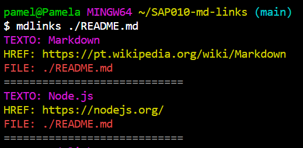
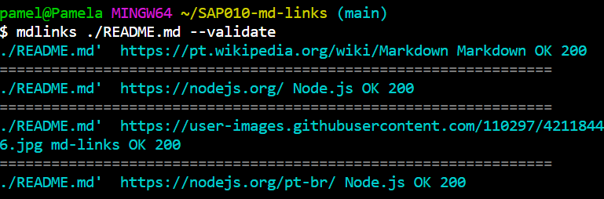
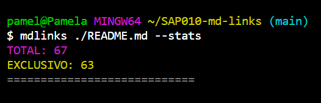
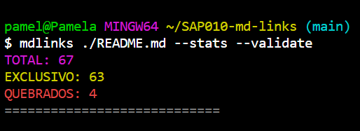

# Markdown Links

## Tecnologias e Ferramentas utilizadas:

## Índice

* [1. Prefácio](#1-prefácio)
* [2. Guia de Instalação](#2-guia-de-instalação)

***

## 1. Prefácio

[Markdown](https://pt.wikipedia.org/wiki/Markdown) é uma linguagem de marcação
muito popular entre os programadores. É usada em muitas plataformas que
manipulam texto (GitHub, fórum, blogs e etc) e é muito comum encontrar arquivos
com este formato em qualquer repositório (começando pelo tradicional
`README.md`).

Os arquivos `Markdown` normalmente contém _links_ que podem estar
quebrados, ou que já não são válidos, prejudicando muito o valor da
informação que está ali.

Uma comunidade open source nos propôs criar uma ferramenta, usando
[Node.js](https://nodejs.org/), que leia e analise arquivos no formato
`Markdown`, para verificar os arquivos que contenham links e mostrar algumas
estatísticas.

### 2. Guia de Instalação

Instale a biblioteca disponível do seu terminal através do comando:  _**npm i md-links-pamelabrsa**_

Após a instalção, execute o seguinte comando:
_**mdlinks ./caminhoDoArquivo/nomeDoArquivo.md**_

Esse comando mostrará todos os links disponíveis do arquivo.md

Para fazer a validação dos links desse arquivo, utilize o comando _**mdlinks ./caminhoDoArquivo/nomeDoArquivo.md --validate**_  
Esse comando retornará os status dos links disponíveis no arquivo

Para verificar as estatísticas, utilize o comando _**mdlinks ./caminhoDoArquivo/nomeDoArquivo.md  --stats**_
Esse comando retornará a quantidade dos links do arquivo e quantos são exclusivos

Já o comando  _**mdlinks ./caminhoDoArquivo/nomeDoArquivo.md  --stats --validate**_  retornará o total de links do arquivo e quantos stão quebrados

